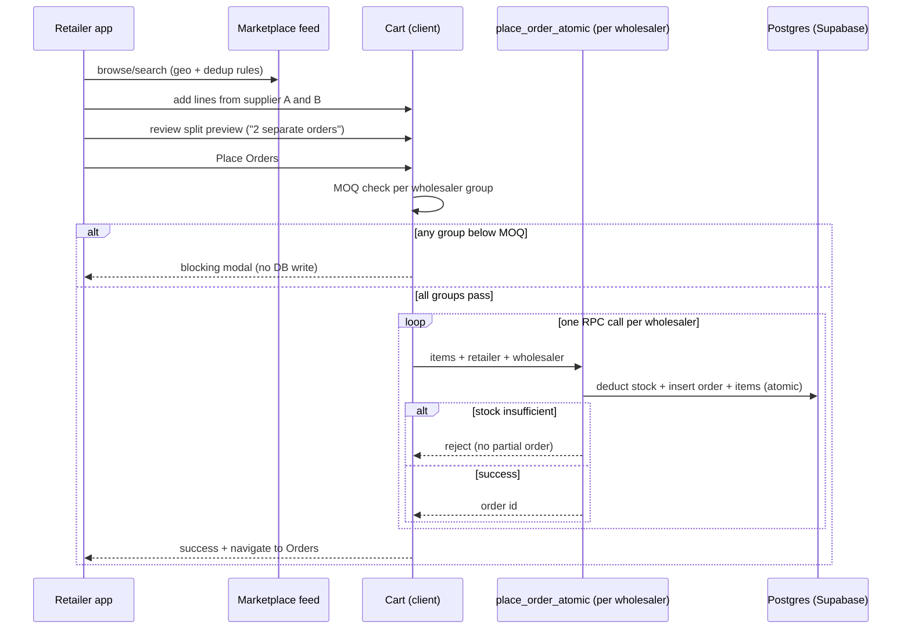
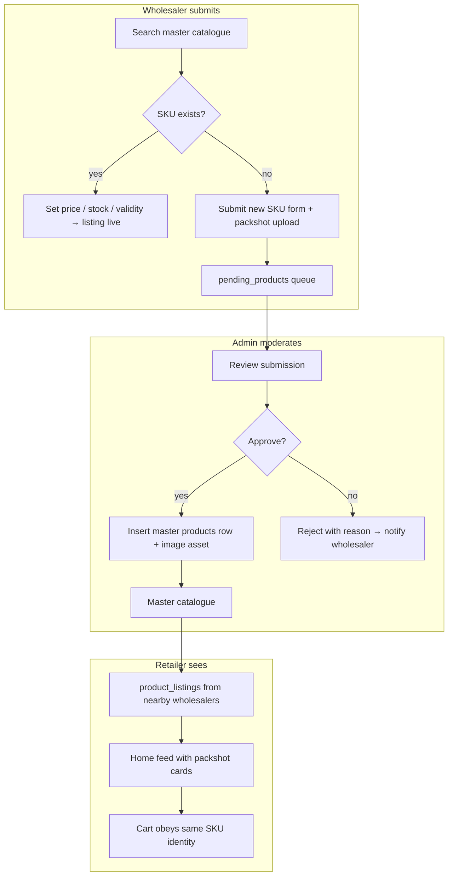

# MandiBhai — B2B Ordering Platform

**Context:** MandiBhai is a B2B FMCG wholesale marketplace for India — kirana retailers ordering stock from nearby mandi wholesalers in one mobile flow. This doc covers the product as built and demoed; it is written for interview and portfolio review, not as a rebuild kit.

**Showcase repo:** [github.com/jaskiringg/mandibhai](https://github.com/jaskiringg/mandibhai) — public snapshot; active development may live in separate frontend/backend repos.

**Ownership note:** MandiBhai has been built with collaborators. I claim only what I can defend in conversation: product/domain design, retailer/wholesaler/admin flows, order and stock integrity model, demo readiness, and substantial frontend/ops work. Backend RPC design, NestJS service scaffolding, and upstream contributions from co-builders are called out where I did not sole-author them.

---

## Problem

Indian kirana retailers still procure FMCG staples through phone calls, WhatsApp threads, and physical mandi visits. Wholesalers run parallel inventory in spreadsheets or legacy POS. The gap is not "another e-commerce app" — it is **coordination at wholesale scale**:

1. **Discovery is local.** A retailer cares about who can deliver Atta today within a few kilometres, not a national catalogue.
2. **Pricing is fragmented.** The same SKU (Mustard Oil, Basmati Rice) may be listed by multiple wholesalers at different prices; the buyer wants the best offer without comparing five phone quotes.
3. **One cart, many suppliers.** Retailers mix SKUs from different wholesalers in a single purchase intent; fulfilment and MOQ rules are per supplier, not per cart.
4. **Stock must be honest.** Overselling one case of dal breaks trust; partial checkout across suppliers must not leave the platform in an inconsistent state.
5. **Catalogue quality drifts.** Without a master SKU layer, every wholesaler invents product names, pack sizes, and images — search and deduplication fail.

MandiBhai targets the wholesaler↔retailer procurement loop for staples (oil, atta, rice, dal, tea), not consumer delivery or credit-ledgers (khata).

---

## Goals and non-goals

### Goals

- Geo-local wholesale sourcing (~20 km radius between retailer shop and wholesaler warehouse)
- Price intelligence: same master SKU → surface cheapest active listing; tie-break on stock
- Multi-supplier cart that **splits into one order per wholesaler** with visible UX before confirm
- Atomic per-order stock deduction at place time (no double-selling on accepted orders)
- Full order lifecycle for wholesalers: placed → accepted → packed → out for delivery → delivered
- Master catalogue with admin moderation for wholesaler-submitted SKUs
- Mobile-first retailer and wholesaler apps; desktop-oriented admin ops shell
- Demo-ready stakeholder walkthrough (role-based test accounts, OTP bypass for dev/demo)

### Non-goals (explicitly out of scope today)

- Payment gateway integration (COD label only)
- Push notifications (FCM) — local notification store only
- Live delivery tracking / maps
- Khata / credit ledger between retailer and wholesaler
- AI POS, deep analytics dashboards (present as MOCK/STUB in nav)
- National consumer marketplace or D2C fulfilment

---

## Roles

| Role | Primary device | What they do |
|------|----------------|--------------|
| **Retailer (buyer)** | Mobile (Capacitor Android / mobile web) | Set shop location, browse geo-filtered feed, search, cart, place split orders, track status, reorder |
| **Wholesaler (seller)** | Mobile | Set warehouse location, list from master catalogue or submit new SKU, manage price/stock, process order lifecycle, view inventory |
| **Admin (ops)** | Desktop / tablet | Dashboard overview, product moderation, master catalogue browse, wholesaler oversight, order monitoring |

Role picker is the first screen after brand. Phone OTP is the intended auth path; demo mode bypasses OTP for stakeholder demos.

---

## Feature inventory

| Domain | Feature | Status | Notes |
|--------|---------|--------|-------|
| **Auth** | Role-first login (Retailer / Wholesaler / Admin) | Live (demo) | OTP path wired; demo bypass for fixed test phones |
| **Auth** | Location gate for retailer/wholesaler | Live | Admin skips location; demo retailers can skip gate |
| **Retailer** | Geo-filtered marketplace feed | Live | ~20 km Haversine; active wholesalers only |
| **Retailer** | Search + category/brand filters | Live | |
| **Retailer** | Price dedup (cheapest listing per master SKU) | Live | Demo build may show all catalogues without geo/dedup |
| **Retailer** | Product detail + stock-capped add-to-cart | Live | |
| **Retailer** | Multi-wholesaler cart with split preview | Live | "N separate orders" warning before confirm |
| **Retailer** | MOQ enforcement per wholesaler group | Live | Blocking modal on shortfall — no partial DB write |
| **Retailer** | Place order via atomic RPC per wholesaler | Live | Sequential per supplier, not one global transaction |
| **Retailer** | Orders list + status tracking | Live | |
| **Retailer** | Buy Again / frequent carts | Partial | localStorage-backed |
| **Retailer** | Analytics / AI POS | MOCK/STUB | Nav present; not product |
| **Wholesaler** | Catalogue health dashboard | Live | Status cards: OOS, expired, pending, active, etc. |
| **Wholesaler** | List existing master SKU (price, stock, validity) | Live | Creates/updates `product_listings` |
| **Wholesaler** | Submit new SKU for moderation | Partial | Flow designed; pending queue fetch gap in demo |
| **Wholesaler** | Inventory inline edit | Live | Price/stock/active toggle |
| **Wholesaler** | Order lifecycle actions | Live | Accept → pack → out for delivery → deliver |
| **Wholesaler** | Realtime order notifications | Partial | Supabase channel + local notification store |
| **Admin** | Dashboard KPIs | Partial | Shell live; some stats hardcoded |
| **Admin** | Product moderation (approve/reject) | Live (UI) | Queue wiring incomplete in demo |
| **Admin** | Master catalogue browse/search | Live | Grid with packshot, category, brand |
| **Admin** | Master SKU add/edit CRUD | Partial | Buttons present; full CRUD unwired |
| **Admin** | Wholesaler list + enable/disable | Partial | UI partially wired |
| **Admin** | Retailer management | STUB | "Coming soon" |
| **Admin** | Global orders monitor + PDF export | Partial | Fetch/export unwired |
| **Platform** | Dark mode (retailer/wholesaler) | Live | localStorage preference |
| **Platform** | Payment | Label only | Cash on delivery |
| **Platform** | NestJS backend repo | Scaffold | Present as `MandiBhai-BACKEND`; primary data path today is Supabase client + RPC |

---

## Core workflows

### Retailer order placement (multi-supplier split)



**Design constraints:**

- Cart split is a UX contract — always show how many orders will be created before confirm.
- Multi-wholesaler checkout is **sequential per wholesaler**, not one global transaction. If order 2 fails after order 1 succeeds, the retailer sees a partial success state (known gap; production should surface explicit recovery UX).
- Stock deduction happens at place time inside RPC, not at cart-add time (cart respects available stock caps client-side).

### Admin SKU and packshot workflow (conceptual ops)

Design pack targets (catalogue, packshots, cart, home) describe how ops is meant to run even where UI wiring is incomplete:



**Packshot / image model (conceptual):**

- Master SKU carries an `image_key` resolved to Supabase Storage public URL or placeholder asset.
- Admin catalogue grid shows packshot, category chip, brand, and asset-health indicator ("Asset OK" when image present).
- Wholesaler catalogue and retailer home reuse the same master identity so search, dedup, and cart lines stay aligned.
- Moderation is the gate for net-new SKUs — wholesalers cannot bypass master catalogue for custom naming.

---

## Conceptual data model

Entities and field **purpose** only — no DDL.

### Identity

| Entity | Purpose |
|--------|---------|
| `users` | Auth identity; role: retailer \| wholesaler \| admin |
| `retailers` | Shop profile, lat/lng, pincode, KYC fields |
| `wholesalers` | Business name, location, `minimum_order_value`, active flag |

### Catalogue

| Entity | Purpose |
|--------|---------|
| `products` | Master catalogue SKU (name, brand, category, image_key) |
| `product_listings` | Wholesaler offer: price, stock, active, validity |
| `pending_products` | Wholesaler-submitted SKU awaiting admin approval |

### Orders

| Entity | Purpose |
|--------|---------|
| `orders` | One row per retailer↔wholesaler checkout; total, status, payment label |
| `order_items` | Line items: product_id, quantity, price at time of order |

**Order statuses:** `placed` → `confirming` → `accepted` → `packed` → `out_for_delivery` → `delivered`; also `cancelled`, `unfulfillable`.

### Client-only (today)

| Store | Purpose |
|-------|---------|
| Cart | In-memory; grouped by wholesaler |
| `frequentCarts` | localStorage reorder shortcuts |
| Notifications | localStorage (not push) |
| Theme | Dark mode preference |

### Relationships (conceptual)

```
Retailer ──places──► Order ──contains──► Order items
                          │
Wholesaler ◄──fulfills───┘
     │
     └──► Product listings ──references──► Master products
                    ▲
     Pending products ──on approve──┘
```

---

## Architecture

### Stack (high level)

Next.js (App Router) · React · TypeScript · Tailwind · Supabase (Auth, Postgres, Storage, Realtime) · Capacitor Android wrapper · NestJS backend repo (`MandiBhai-BACKEND`) as parallel/forward path

Legacy Vite + React codebase exists under `_legacy_vite_code`; current product shell is Next.js (`MandiBhai-FRONTEND`).

### Client architecture

Single large client store (`StoreContext`) holds auth, catalogue, cart, orders, and role-specific views. Mobile-first bottom nav for retailer/wholesaler; admin uses sidebar ops layout.

| Surface | Nav pattern | Key routes |
|---------|-------------|------------|
| Retailer | Bottom nav: Home · Orders · Buy Again · Cart · Profile | Product list/detail, deliveries, KYC, settings |
| Wholesaler | Bottom nav: Catalogue · Inventory · Orders · Analytics · Profile | Product form, status filters, deliveries |
| Admin | Sidebar: Dashboard · Moderation · Catalogue · Wholesalers · Orders | Desktop ops shell |

### Backend/data path

Primary write path for orders: Supabase client → Postgres RPC `place_order_atomic` (atomic stock deduct + order insert per wholesaler). Auth via Supabase phone OTP (demo bypass for fixed test accounts).

NestJS backend is present as a scaffolded service layer; it is not the sole production path in the demo build described here. Treat Supabase RPC + RLS as the load-bearing contract until NestJS modules are fully wired.

### Realtime

Supabase channels can push order status and listing updates to connected clients. Push notifications to device OS are not shipped.

---

## Problems encountered and ADRs

### ADR-001: Per-wholesaler atomic RPC vs global cart transaction

**Decision:** One `place_order_atomic` call per wholesaler group, not a single multi-supplier transaction.

**Why:** MOQ, stock, and fulfilment are wholesaler-scoped. A global two-phase commit adds complexity without matching how mandi suppliers actually invoice and deliver.

**Trade-off:** Partial failure after first order succeeds requires explicit recovery UX (retry failed group, show which orders were created). Demo does not fully polish this edge.

### ADR-002: Master catalogue + moderation vs free-text listings

**Decision:** Wholesalers list from master SKUs or submit new products into a pending queue.

**Why:** Dedup by product name and packshot consistency depend on a canonical SKU layer. Without it, "Mustard Oil 1L" and "Sarson Tel 1 Litre" fragment search.

**Trade-off:** Admin moderation latency blocks new SKU go-live; ops tooling must stay fast (approve/reject, packshot attach).

### ADR-003: Demo mode OTP bypass

**Decision:** Fixed demo phones skip OTP and optionally skip location gate for stakeholder demos.

**Why:** MSG91/Twilio OTP integration was scheduled post-demo; stakeholders needed a frictionless walkthrough.

**Trade-off:** Demo behavior diverges from production (geo/dedup may be relaxed in demo feed). Production auth must re-enable strict gates.

### ADR-004: Client-heavy cart vs server cart

**Decision:** Cart lives client-side until place-order; server validates stock at RPC time.

**Why:** Faster iteration for mobile UX; mandi orders are low-frequency per session.

**Trade-off:** Stale stock between browse and checkout surfaces as RPC rejection — acceptable if error copy is clear.

---

## Operations

### Demo runbook (stakeholder)

~15 minute script covering three roles:

1. **Retailer:** login → location → browse deduped feed → multi-supplier cart → place split orders → confirm Orders tab
2. **Wholesaler:** incoming orders → lifecycle to Delivered → verify inventory deduction
3. **Admin:** dashboard → moderation queue → master catalogue browse

Demo accounts use role-specific phone numbers with Dev Bypass (No OTP). Amber banner indicates demo mode.

### Production readiness gaps (as of demo build)

| Gap | Target remediation |
|-----|-------------------|
| Live OTP (MSG91/Twilio) | ~2 days engineering [VALIDATE] |
| Payment gateway (UPI/Razorpay) | Post-MVP |
| Play Store signing + submission | ~2 weeks from prod auth [VALIDATE] |
| Admin pending queue fetch | Wire `pending_products` read path |
| Admin CRUD on master catalogue | Complete add/edit wiring |
| NestJS backend parity | Define which routes move off direct Supabase client |

### Environments

Local dev: Next.js on port 5173 (or Next default); Android via Capacitor APK. Supabase project hosts auth, DB, storage — credentials not published here.

---

## Outcomes

| Outcome | Status |
|---------|--------|
| End-to-end demo across retailer, wholesaler, admin roles | Shipped (demo build) |
| Multi-supplier cart split with atomic stock per order | Shipped |
| Master catalogue + moderation UX shell | Partial (queue/CRUD gaps) |
| Production OTP + payments + Play Store | Not shipped |
| NestJS backend as primary API | Not shipped — scaffold only |

Specific adoption, GMV, or retailer count metrics are **[VALIDATE]** — not claimed here.

---

## Screenshots

### Master catalogue (admin)


*Verified master SKUs (Mustard Oil, Atta, Rice, etc.) with packshot assets and category labels. Intended ops surface for catalogue consistency.*

### Wholesaler orders dashboard


*Wholesaler view of retailer-placed orders with Accept / Pack / Deliver workflow.*

### Order success (retailer)


*Confirmation after split checkout — two orders created from one cart.*

### Retailer orders list


*Post-checkout order list showing per-wholesaler orders at Placed status.*

---

## Claim checklist

Use before publishing externally. Tick when verified.

### Problem and scope

- [ ] Problem framing matches kirana wholesale procurement (not D2C delivery)
- [ ] Non-goals list is accurate (no payments, no khata, no live tracking)
- [ ] Co-builder/upstream contributions acknowledged where applicable
- [ ] Only defendable ownership claims remain in first person

### Demo and production status

- [ ] Demo OTP bypass accurately described (not production auth)
- [ ] COD label-only payment status correct
- [ ] NestJS backend described as scaffold, not sole production path
- [ ] Partial/multi-order failure edge case acknowledged
- [ ] Admin pending queue / CRUD gaps marked Partial where true

### Metrics and timelines

- [ ] No unvalidated GMV, user count, or revenue claims
- [ ] OTP / Play Store timelines marked [VALIDATE] if cited
- [ ] "Production-ready on backend" phrasing matches actual demo script claims [VALIDATE]

### Screenshots

- [ ] `/shots/mandibhai-catalogue.png` matches current admin UI
- [ ] `/shots/mandibhai-wholesaler.png` matches wholesaler orders UI
- [ ] `/shots/mandibhai-order-success.png` matches checkout success state
- [ ] `/shots/mandibhai-retailer-orders.png` matches retailer orders tab
- [ ] No real phone numbers, API keys, or customer PII visible

### Anti-clone redaction

- [ ] No Supabase project URLs, anon keys, or service role secrets
- [ ] No full RPC source or DDL for `place_order_atomic`
- [ ] No demo phone numbers copied as "production accounts"
- [ ] No step-by-step rebuild or clone recipe
- [ ] No exact geo radius tuning constants presented as contractual SLA
