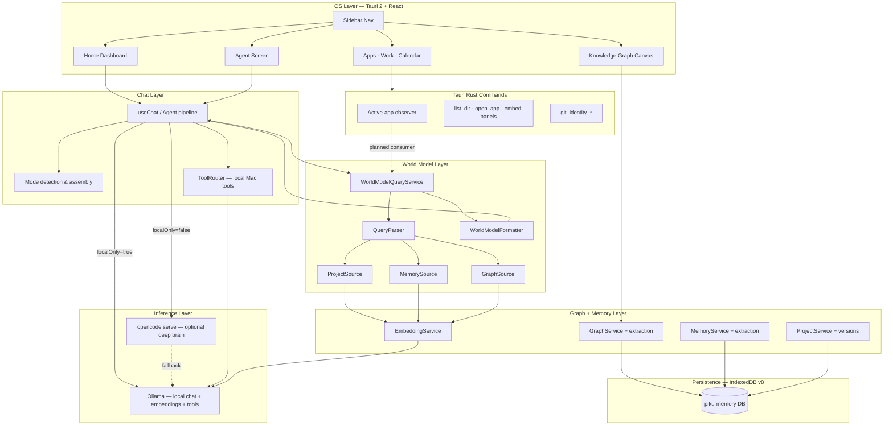

# PIKU — Local-First AI Workspace

**Status:** Active development · IndexedDB v8 · Tauri 2 desktop shell  
**Thesis:** The model is replaceable; the understanding should not be. PIKU is an ambient operating layer that accumulates a private **World Model** of your work, relationships, and decisions — not another stateless chat window.


---

## 1. Problem

Modern AI assistants optimize for **turn-level fluency**, not **life-level continuity**. Each session starts cold. Context must be re-explained. Project history, decision rationale, and cross-tool signals (mail, calendar, commits) stay siloed in the apps that generated them.

For someone who owns systems end-to-end — discovery through production support — this gap is structural:

| Pain | Why chatbots fail |
|------|-------------------|
| **Context amnesia** | No durable store of who you are, what you're building, or why a decision was made |
| **Tool fragmentation** | Gmail, GitHub, Jira, and local files each hold partial truth; no unified query surface |
| **Privacy vs capability** | Cloud models reason well but exfiltrate context; local models are private but weak on hard asks |
| **Interrupt cost** | Full-screen chat pulls you out of flow; ambient work needs lightweight invocation |

PIKU treats **memory and structure as the product**. Inference is a swappable engine. The World Model — graph + embeddings + project context + extracted facts — is what compounds over months and years.

---

## 2. Goals & Non-Goals

### Goals

1. **Local-first persistence** — All World Model data (memories, graph, projects, agent sessions) lives on-device in versioned IndexedDB. Works offline for retrieval and local inference.
2. **Ambient availability** — Global hotkey (⌥+Space) opens a minimal quick-ask overlay; the main shell is a navigable OS with dedicated surfaces for work domains.
3. **Structured memory** — Dual stores: a **fact memory** layer (categorized, confidence-gated) and a **knowledge graph** (~9 node types, ~10 relationship types) with hybrid retrieval.
4. **Context engineering per turn** — Every user message triggers parallel World Model query + conversation summary retrieval before the brain sees the prompt. Dynamic context is appended; static persona prefix stays byte-stable for KV-cache reuse.
5. **Agent workflows with real tools** — Agent mode routes through a tool-capable path: open apps, check mail/calendar, query GitHub, search web, read home directory, save/recall memory.
6. **User sovereignty** — Settings → Privacy → **Local-only** disables the optional cloud reasoning path (ADR-006). Embeddings and tool execution remain local regardless.
7. **Extensible observation** — Connectors (GitHub, Gmail, Google Calendar) and an active-app observer (Rust, consent-gated) feed the observation loop; new sources implement a `ContextSource` registry interface.

### Non-Goals

| Non-goal | Rationale |
|----------|-----------|
| **General-purpose chatbot** | No "new conversation" product loop; sessions are contexts tied to projects and the graph |
| **Cloud-hosted SaaS** | No multi-tenant backend; optional cloud brain is user-controlled and proxied locally |
| **Autonomous agent without confirmation** | Consequential World Model writes and external actions require user approval or explicit tool invocation |
| **Replacing Gmail/GitHub/Jira** | PIKU orchestrates and summarizes; embedded panels and deep links, not full replacements |
| **Personality-as-data (yet)** | Settings UI exists; declarative persona files are roadmap, not shipped |

---

## 3. Users & Primary Surfaces

**Primary user:** A technical operator (developer, architect, founder) who juggles multiple projects, identities (work/personal), and tools — and wants one private layer that remembers context across all of them.

Navigation is fixed in the sidebar — fourteen surfaces, each a domain over the same World Model:

| # | Surface | Role |
|---|---------|------|
| 01 | **Home** | Dashboard: greeting, ambient ask bar, project snapshot, World Model node count, today's connector feed, system status |
| 02 | **Agent** | Multi-session control hub: named contexts, live reasoning panel, tool trace, project linking, sticky approach modes |
| 03 | **Models** | Local Ollama model picker, opencode deep-brain status, manual handoff to external assistants (user's own accounts) |
| 04 | **Projects** | CRUD for tracked projects: vision, state, in-progress work, blockers, decisions; links to project galaxy in Knowledge |
| 05 | **Knowledge** | Force-directed graph visualization ("cosmic void" theme); galaxy clustering by project/core/brainstorm |
| 06 | **Datasets** | Inventory dashboard: project count, graph stats, model list, memory totals, project-brain vault entries |
| 07 | **Apps** | Embedded comms: WhatsApp/LinkedIn native webviews, Gmail widget; all inside the shell |
| 08 | **Work** | Git identity switcher, GitHub commit feed, Jira/Confluence/Notion deep links via Piku Chrome profile |
| 09 | **Files** | Sandboxed home-directory browser (read-only `list_dir` via Tauri) |
| 10 | **Calendar** | Merged Google Calendar from connected accounts; work/personal filter |
| 11 | **People** | Person nodes from graph with relationship edges surfaced as cards |
| 12 | **Playground** | Experimental graph/brain inspection surface |
| 13 | **Automations** | User-defined instruction + trigger phrases; capability registry mirroring ToolRouter |
| 14 | **Settings** | Profile (operator name, work/personal email & GitHub), model selection, privacy toggle, connector OAuth, work-tool URLs |

Home and Agent share the same session store (`agentHub`) — a turn on Home is visible in Agent and vice versa.

---

## 4. Feature Inventory

| Feature | Surface | State | Notes |
|---------|---------|-------|-------|
| Ambient quick-ask overlay | Global (⌥+Space) | Built | Local-only path; brief answers |
| Immersive Home ask bar | Home | Built | Full context pipeline |
| Multi-session Agent contexts | Agent | Built | IndexedDB-backed; project link optional |
| Live reasoning panel | Agent | Built | Streams thinking + answer separately |
| Sticky approach modes | Agent | Built | `/execute`, project mode, etc. |
| World Model hybrid retrieval | Chat pipeline | Built | Project + Memory + Graph sources in parallel |
| Post-turn memory extraction | Background | Built | Confidence-gated; fire-and-forget |
| Post-turn graph extraction | Background | Built | Edges pending until strength threshold |
| Conversation summaries | Chat pipeline | Built | Rolling narrative beyond atomic facts |
| Knowledge graph viz | Knowledge | In progress | Force-directed; galaxy clustering |
| Local Ollama chat | Models / system | Built | Default `qwen3:4b`; user-selectable |
| Local embeddings | System | Built | Pinned model; 768-dim vectors |
| opencode deep brain | Models / routing | Built | Local `opencode serve` proxy; free capable model |
| Local-only privacy toggle | Settings | Built | Disables cloud reasoning path |
| ToolRouter (Mac tools) | Agent / chat | Built | Apps, mail, calendar, GitHub, web, memory |
| GitHub connector (multi-account) | Work / Settings | Built | Commits, repos, activity |
| Gmail connector | Apps / Work / Settings | Built | OAuth; inbox widget |
| Google Calendar connector | Calendar / Settings | Built | Merged work/personal |
| Embedded WhatsApp / LinkedIn | Apps | Built | Tauri multi-webview |
| Jira / Confluence / Notion links | Work | Built | Piku Chrome profile |
| Git identity one-click switch | Work | Built | Global `user.name` / `user.email` |
| Files browser | Files | Built | Home-relative; read-only |
| People graph view | People | Built | Live query over person nodes |
| Datasets inventory | Datasets | Built | Read-only stats |
| Automations (localStorage) | Automations | Partial | CRUD UI; trigger matching planned |
| Active-app observer | Rust layer | Dormant | Built; awaiting consent surface |
| Drag-drop document ingestion | Datasets | Planned | Chunker/extractor exist; wiring pending |
| Embedded PTY terminal | Work | Planned | |
| File preview / vault capture | Files | Planned | Runtime vault concept exists |
| Personality-as-data | Settings | Planned | |
| Relationship timeline | People | Planned | |

---

## 5. System Architecture

PIKU follows a **layered ambient OS** model: shell chrome, chat/reasoning, graph/memory, World Model query, and apps/connectors.



**Trust boundaries:**

- **Always local:** IndexedDB, embeddings, ToolRouter execution, connector token storage, file listing under home.
- **User-opt-out cloud:** Conversation + reasoning text routed to opencode proxy when Local-only is off. Context is assembled locally first; only the assembled turn leaves the machine.
- **User-owned OAuth:** Gmail/GitHub/Calendar tokens are per-account, stored locally, never sent to a PIKU server (there isn't one).

---

## 6. Memory → Retrieve Sequence

Every chat turn runs context retrieval **before** inference. This is the core context-engineering loop — not a RAG bolt-on.

```mermaid
sequenceDiagram
  actor User
  participant UI as Home / Agent UI
  participant Hub as agentHub session
  participant WM as WorldModelQueryService
  participant Sum as ConversationSummaryService
  participant Embed as EmbeddingService
  participant PS as ProjectSource
  participant MS as MemorySource
  participant GS as GraphSource
  participant Brain as Ollama / opencode
  participant Tools as ToolRouter
  participant Ext as Extraction pipeline

  User->>UI: Send message
  UI->>Hub: Record user turn
  par Parallel retrieval
    UI->>WM: queryForContext(message)
    WM->>Embed: embed query (once)
    par Source fan-out
      WM->>PS: retrieve(parsedQuery)
      WM->>MS: retrieve(parsedQuery)
      WM->>GS: retrieve(parsedQuery)
    end
    PS-->>WM: project / decision fragments
    MS-->>WM: memory fragments
    GS-->>WM: graph node + edge fragments
    WM->>WM: dedupe · rank · compute confidence
    WM-->>UI: formatted World Model block
    UI->>Sum: getContext(message)
    Sum-->>UI: rolling summary block
  end
  UI->>UI: Assemble system prompt<br/>(persona · world model · summary)
  alt Tool intent detected
    UI->>Tools: route with context
    Tools->>Brain: local tool-capable model
    Tools-->>UI: tool results + streamed answer
  else Deep reasoning (opencode on)
    UI->>Brain: opencode proxy stream
  else Local-only or fallback
    UI->>Brain: Ollama stream
  end
  Brain-->>UI: Stream thinking + answer
  UI->>Hub: Persist assistant turn
  UI-->>Ext: Fire-and-forget extraction
  Ext->>Ext: Memory candidates + graph edges
  Note over Ext: Pending below threshold;<br/>confirmed facts enter retrieval
```

**Retrieval signals (conceptual — not exact weights):**

| Store | Keyword match | Semantic similarity | Structural |
|-------|---------------|---------------------|------------|
| Memories | Term overlap on content | Cosine vs query embedding | Importance, recency, access count |
| Graph nodes | Term overlap on name/type | Cosine vs node embedding | Edge connectivity bonus |
| Projects | Term overlap on vision/state | Semantic on project fields | Linked decisions, blockers |

Confirmed memories require high extraction confidence; pending memories are stored for review but **excluded from retrieval** to prevent pollution.

---

## 7. Conceptual Data Model

### IndexedDB stores (v8)

| Store | Purpose |
|-------|---------|
| `memories` | Atomic user facts with category, confidence, importance, embedding |
| `summaries` | Rolling conversation narratives with embeddings |
| `conversations` | Full verbatim chat history (legacy path) |
| `agentContexts` | Named Agent sessions with turns, optional project link, sticky mode |
| `projects` | Tracked work: vision, state, work lists, embedded decisions |
| `pendingProjectUpdates` | Extraction proposals awaiting review |
| `contextVersions` | Immutable project snapshots after approved updates |
| `graphNodes` | Typed entities with optional 768-dim embedding |
| `graphEdges` | Directed relationships with strength + confirmed/pending status |

Settings (`pikuSettings`) live in **localStorage**, not IndexedDB — identity, models, privacy flag, work-tool URLs. Embedding model is intentionally **not** user-editable (vector invalidation risk).

### Graph ontology (~9 node types)

| Type | Represents |
|------|------------|
| `project` | A body of work PIKU tracks |
| `goal` | Long-horizon objective |
| `skill` | Capability area |
| `person` | Someone in the operator's world |
| `memory` | Graph-anchored fact node |
| `decision` | Recorded choice with rationale |
| `repository` | Code repo reference |
| `technology` | Tool, framework, or platform |
| `concept` | Domain or architectural concept |

### Graph relationships (~10 types)

`depends_on` · `supports` · `blocks` · `caused_by` · `related_to` · `owned_by` · `uses` · `supersedes` · `implements` · `part_of`

Edges carry **strength** (0–1) and **status**. High-confidence extractions auto-confirm; weaker edges stay pending until reinforced.

### Memory categories (13)

Personal facts, relationships, preferences, goals, ongoing projects, important dates, corrections, habits, achievements, skills, career, health preferences, locations — each with a default importance band used at retrieval rank time.

### World Model query result shape

`WorldModelResult` aggregates ranked: projects, decisions, blockers, current work items, graph entities, graph relationships, memories, recent context version diffs — plus a computed confidence score and contributing source list.

---

## 8. Brain Routing & Privacy

Two inference paths coexist by design (ADR-006):

| Path | When | Handles |
|------|------|---------|
| **Local Ollama** | Always available; forced when Local-only | Ambient quick-ask, tool routing, embeddings, fallback chat |
| **opencode proxy** | Default when Local-only off | Deep reasoning, complex multi-step answers |

Tools and embeddings **never** leave the machine. Only assembled conversation context transits to opencode when enabled.

Settings → Privacy → **Local-only** (`pikuSettings.localOnly`) is the single kill switch — persisted, reactive, honored everywhere `isOpencodeBrain()` is checked.

Future: swap opencode for a self-hosted private model without changing routing architecture (model ID stays behind the provider abstraction).

---

## 9. Agent Workflows

Agent mode is not a separate product — it is the **tool-capable control hub** over the same World Model.

**Session model:** Multiple named `AgentContext` records. Each holds ordered turns, optional `projectId`, and a sticky **mode** (`auto`, execute-oriented modes, etc.). Mode detection runs per turn; cleaned message text strips mode prefixes.

**Reasoning visibility:** Complex asks may produce a structured reasoning flow (understand → plan) shown in the live panel before execution. Streaming separates **thinking** tokens from **answer** tokens.

**Tool surface (by capability group):**

| Group | Capabilities |
|-------|--------------|
| OS / Apps | Open/focus apps, open links/paths, list home files |
| Comms | Gmail inbox query, Calendar event query |
| Dev / GitHub | Commits today, list repos, recent activity |
| Web | Search + fetch top results for summarization |
| Memory | Save fact, recall facts, datetime |

Tools execute locally via Ollama tool-calling through ToolRouter. Agent replies enforce **reply discipline** — answer-first, no meta-narration about "the user wants…".

**Automations (partial):** User stores `{ name, instruction, trigger }` in localStorage. Full trigger-phrase → intent matching is planned; capability registry already documents the tool catalog.

---

## 10. Connectors & Observation Loop

**Built connectors:**

- **GitHub** — Multi-account PAT; commits, repos, activity widgets on Work/Home.
- **Gmail** — Google OAuth; inbox widget, `gmail_check` tool.
- **Google Calendar** — Same OAuth family; merged account list; work/personal tagging by email.

**Embedded surfaces:**

- WhatsApp / LinkedIn — Native Tauri child webviews positioned over DOM regions.
- Jira / Confluence / Notion — Open in dedicated Chrome profile (`open_in_piku_chrome`).

**Observation layer (Phase 2 — partially built):**

- Rust **active-app observer** captures foreground app context.
- Currently **dormant** pending a consent UI and a registered `ContextSource` consumer.
- Design rule: new sources implement `ContextSource.register()` — they do not open IndexedDB directly.

---

## 11. Stack (Conceptual)

| Layer | Choice | Why |
|-------|--------|-----|
| Shell | **Tauri 2** | Native macOS integration: hotkey overlay, webview embeds, FS/git commands, tray |
| UI | **React 18 + Tailwind** | Component model for dense HUD surfaces; framer-motion for micro-interaction |
| Local inference | **Ollama** | Chat, embeddings, tool-capable small models on-device |
| Deep reasoning | **opencode serve** (optional) | Capable free model via local proxy; not a PIKU-hosted API |
| Persistence | **IndexedDB** (via `idb`) | Versioned schema, portable, no native DB dependency |
| Settings | **localStorage** | Reactive store with env-var defaults |
| Tests | **Vitest + fake-indexeddb** | Graph seed tests, World Model source tests, store round-trips |

No PIKU cloud backend. No Supabase. No server-side RAG index.

---

## 12. Architecture Decision Records

### ADR-001: Local-first architecture

**Status:** Accepted (partially revised by ADR-006)  
**Context:** PIKU must function without internet for retrieval, embeddings, and tools.  
**Decision:** Primary inference runs locally via Ollama.  
**Consequences:** No API cost for local path; capability bounded by local model size; full privacy for on-device turns.

### ADR-002: IndexedDB for storage

**Status:** Accepted  
**Context:** Cross-platform persistence in a Tauri desktop app without native DB bindings.  
**Decision:** Versioned IndexedDB schema (`piku-memory`, currently v8).  
**Consequences:** Portable, good-enough performance; migrations must be non-destructive; no server-side backup unless user exports.

### ADR-003: Knowledge graph for memory

**Status:** Accepted  
**Context:** Structured relationships enable context-aware answers beyond flat fact retrieval.  
**Decision:** TypeScript-native graph with ~9 node types and ~10 relationship types; extraction pipeline populates automatically.  
**Consequences:** Flexible querying; requires extraction quality gates; graph can grow large → clustering needed.

### ADR-004: Hub-and-spoke graph visualization

**Status:** Accepted  
**Context:** Operators need to explore what PIKU knows, not just query it.  
**Decision:** Force-directed layout with "cosmic void" visual theme; galaxy clustering by project.  
**Consequences:** Intuitive browsing; large graphs need clustering performance work.

### ADR-005: nomic-embed-text for embeddings

**Status:** Accepted  
**Context:** Semantic search over memories and graph nodes requires local embeddings.  
**Decision:** Fixed embedding model via Ollama; 768-dimensional vectors.  
**Consequences:** Local, no API cost; model change would invalidate all stored vectors — intentionally not exposed in Settings.

### ADR-006: opencode as the deep-thinking brain (revises ADR-001)

**Status:** Accepted  
**Context:** Local 4B model is fast and private but weak on hard reasoning.  
**Decision:** Route conversation/reasoning to a capable free model through local `opencode serve` proxy, with Ollama as automatic fallback. Tools + embeddings stay local.  
**Consequences:** Better reasoning at no direct API cost; conversation context leaves machine by default → mitigated by Settings → Privacy → **Local-only** toggle restoring fully-local operation.

### ADR-007: User-editable settings as source of truth

**Status:** Accepted  
**Context:** Identity, models, privacy, and work links were previously hardcoded or env-only.  
**Decision:** Single persisted reactive store (`pikuSettings` + `useSettings`); defaults from env vars; all consumers read live.  
**Consequences:** Everything changeable from Settings without rebuilds; embedding model excluded by design.

---

## 13. Roadmap & Open Work

| Phase | Scope | Status |
|-------|-------|--------|
| 1 | Core chat + graph infrastructure | **Built** |
| 2 | World Model + observation loop | **Built** (observer dormant) |
| 3 | Graph visualization | **In progress** |
| 4 | Vault filesystem + document absorption | Vault concept built; drag-drop pending |
| 5 | Calendar, git, browser integrations | **Built** |
| 6 | Personality-as-data + settings UI | Settings **built**; personality-as-data pending |

**Still open:** embedded PTY terminal · drag-drop dataset ingestion · file preview · pending-update review queue · People relationship timeline · observer consent gate · personality-as-data.

---

## 14. Testing & Quality Posture

- **Unit tests** on graph seed integrity, World Model source scoring, IndexedDB store round-trips, Agent context persistence.
- **Confidence gating** tested at extraction boundary — pending vs confirmed thresholds.
- **Isolation** — World Model source failures are per-source (`Promise.allSettled`); one dead connector does not block retrieval.
- **No production rebuild recipe in this doc** — tests assume local Ollama + dev env; CI posture not yet standardized.

---

## 15. Risks & Trade-offs

| Risk | Mitigation |
|------|------------|
| Graph pollution from weak extractions | Pending edge/memory status; confirmed-only retrieval |
| Embedding model lock-in | Documented ADR-005; migration would require re-embed job |
| Cloud brain privacy default | Local-only toggle; clear Settings labeling |
| Large graph render performance | Galaxy clustering; cap nodes in retrieval (top-K) |
| OAuth token rot | Per-connector refresh; reconnect UX in Settings |
| Observer creepiness | Consent gate before any active-app data enters World Model |

---

## Anti-Clone Claim Checklist

Doc: `content/work/piku.md` · Reviewer: _pending_ · Date: 2026-07-24

| Claim | Pass |
|-------|------|
| Problem, constraints, and non-goals stated | ✅ |
| Feature catalog describes **behavior**, not implementation recipes | ✅ |
| Mermaid workflows at **behavior level** (architecture + retrieval sequence) | ✅ |
| Trust boundaries and **why** documented | ✅ |
| Conceptual data model — entity purposes, not full DDL | ✅ |
| ADRs and trade-offs included | ✅ |
| Testing / rollout described in sanitized terms | ✅ |
| Screenshot referenced (`/shots/piku-home.png`) — no PII | ✅ |
| **No** full production prompts / system prompts / tool schemas verbatim | ✅ |
| **No** env vars, API keys, project IDs, webhook secrets | ✅ |
| **No** copy-paste SQL/DDL migrations or RLS that recreate the product | ✅ |
| **No** step-by-step clone-and-run production recipe | ✅ |
| **No** exact proprietary score weights (bands / signal names only) | ✅ |
| **No** private vault contents or runtime file paths | ✅ |
| **No** enough business rules for a competitor twin | ✅ |

**Anti-clone pass:** ✅ yes
