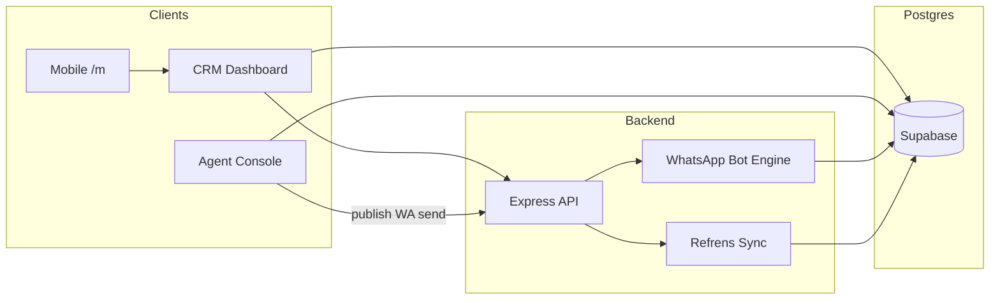
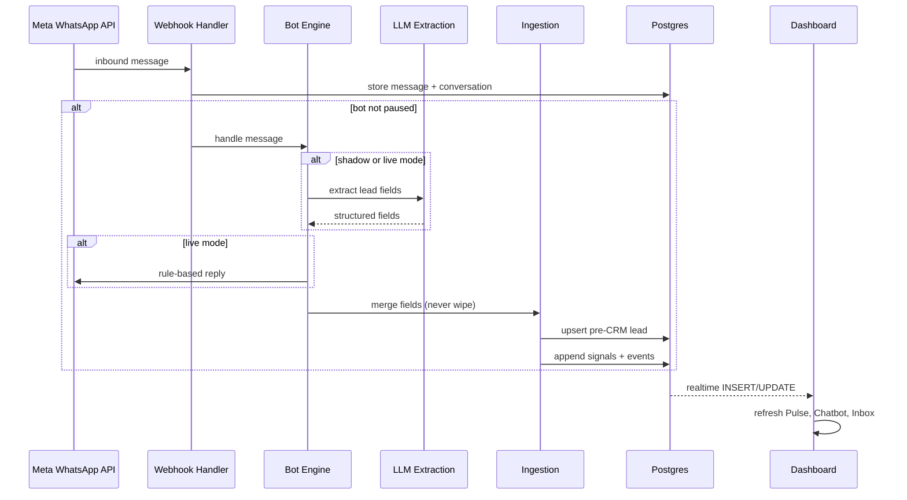
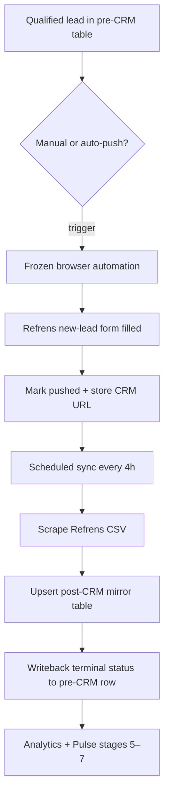
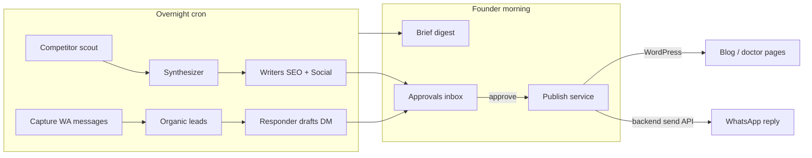
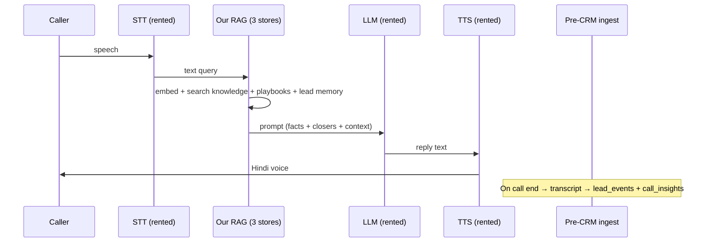
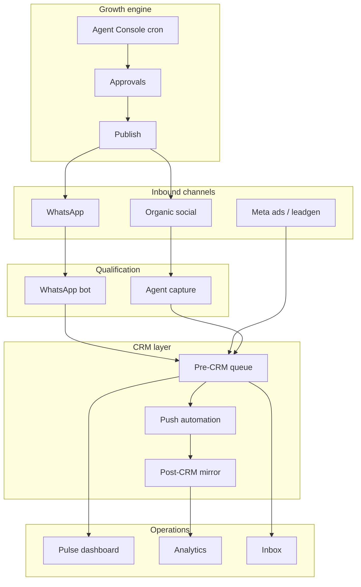

# ReliveCure — Clinic Operations Case Study

**Context:** I operate a LASIK clinic in India and built the software that runs its sales floor. This is not a generic AI chatbot product — it is a **founder-only Sales Control Center** that sits between inbound channels (WhatsApp, Meta ads, organic social) and the clinic's external CRM (Refrens), where reps actually work leads.

**Production surfaces (public URLs):**

| Surface | URL | Role |
|---------|-----|------|
| CRM Dashboard | [relive-cure-dashboard-production.up.railway.app](https://relive-cure-dashboard-production.up.railway.app) | Sales ops command center |
| Backend API | [relive-cure-backend-production.up.railway.app](https://relive-cure-backend-production.up.railway.app) | WhatsApp engine, sync, webhooks |
| Marketing site | [relivecure.com](https://relivecure.com) / [relivecure-web-production.up.railway.app](https://relivecure-web-production.up.railway.app) | Public clinic web presence |
| Agent Console | Separate deploy (linked from CRM footer) | Growth engine — content, organic leads |

**Showcase repo:** [github.com/jaskiringg/relive-cure](https://github.com/jaskiringg/relive-cure) — blurred screenshots only; application source is private.

---

## Problem

A single-clinic LASIK operation with five reps faces a predictable ops gap:

1. **Inbound is fragmented.** WhatsApp, Meta lead forms, and organic social all arrive in different places. Reps work Refrens CRM; nothing upstream talks to it natively.
2. **Qualification is manual and slow.** Every WhatsApp thread requires a human to extract age, prescription, insurance, intent — before a lead is even worth pushing to CRM.
3. **Visibility is post-hoc.** Refrens holds rep outcomes (converted, lost, DNP, OPD booked) but not the pre-CRM funnel, bot conversations, or channel attribution in one place.
4. **Organic growth doesn't scale.** Competitor monitoring, SEO drafts, and social content require daily founder time — or they don't happen.

The clinic needed one system that **captures, qualifies, pushes, syncs, and intervenes** — without replacing Refrens (reps won't migrate) and without hiring a marketing team.

---

## Goals and non-goals

### Goals

- Qualify WhatsApp inbound automatically (Hindi/Hinglish), with human takeover when needed
- Push qualified leads into Refrens via automation; sync outcomes back for analytics
- Give the founder a morning dashboard: hot queue, funnel stages, rep performance, SLA breaches
- Run an overnight growth engine (competitor signals → content drafts → founder approval → publish)
- Append-only lead memory (Lore) across WhatsApp, calls, and CRM events — one timeline per phone
- Mobile subset for reps on the floor (`/m` route)

### Non-goals

- Replace Refrens as the rep-facing CRM
- Build a multi-tenant SaaS (single clinic, founder-operated)
- Ship a customer-facing "AI product" UI — the aesthetic target is **clinical sales operations**, not chatbot demo
- Own telephony/STT/TTS engines for voice (see Voice section — designed, not shipped)
- Real-time two-way Refrens API integration (Refrens has no clean API; push/sync uses browser automation, frozen by policy)

---

## Users and surfaces

| Actor | Primary surface | What they do |
|-------|-----------------|--------------|
| Founder / admin | CRM Dashboard (all tabs) | Morning pulse, push to CRM, bot mode, analytics, marketing, operator assistant |
| Sales rep | CRM Chatbot + Inbox + Mobile `/m` | Review pre-CRM queue, reply on WhatsApp, check assigned leads |
| HR staff | HR module | Employee records (isolated from pipeline) |
| Limited role | Chatbot + HR only | Restricted tab set pending admin approval |
| Growth ops (founder) | Agent Console (separate app) | Review overnight drafts, approve/reject, publish to WordPress / WhatsApp |

Three applications, one data layer:



---

## Feature inventory

| Domain | Feature | Status | Notes |
|--------|---------|--------|-------|
| **Pipeline** | Pulse — morning funnel, hot queue, stage river | Live | Pre-CRM stages 1–4 + post-CRM 5–7 |
| **Pipeline** | Chatbot — pre-CRM lead queue | Live | Core product; assignee, status, push trigger |
| **Pipeline** | Auto-push worker | Live | Pushes when qualification threshold met |
| **Conversations** | WhatsApp Inbox | Live | Human takeover, bot pause, 24h window |
| **Conversations** | Lore — lead timeline | Live | Append-only events across channels |
| **CRM Intel** | Analytics — rep performance, loss analysis | Live | Refrens-synced; largest dashboard tab |
| **CRM Intel** | Refrens sync (scheduled + manual) | Live | Frozen Puppeteer automation |
| **CRM Intel** | CRM push (manual + auto) | Live | Frozen Puppeteer form fill |
| **Acquisition** | Meta marketing — campaigns, CPL, leadgen webhook | Live | Stub KPIs when disconnected |
| **Acquisition** | Marketing segments → Chatbot filter | Live | Strongest cross-tab coupling |
| **Acquisition** | Organic leads + multi-line WA | Partial | Backend wired; dashboard tab dark |
| **People** | HR module | Live | Isolated Supabase tables |
| **Automations** | WhatsApp bot — rule + LLM extraction | Live | Modes: off / shadow / live |
| **Automations** | Bot Lab — test harness | Live | Admin-only; no real WA |
| **Automations** | Agent Console — growth cron agents | Live | Separate deploy |
| **System** | RBAC — admin / limited / rep / hr | Live | Tab + permission gating |
| **System** | Operator assistant (founder dev Q&A) | Live | Global orb — redesign target |
| **System** | Web Push notifications | Live | Deep-link to inbox thread |
| **Calls** | Rep app upload + transcribe pipeline | Partial | M4 local job; API partially wired |
| **Voice** | AI voice agent (inbound/outbound) | Designed | Application layer spec only; not shipped |

---

## Core workflows

### WhatsApp inbound → pre-CRM lead (load-bearing spine)



**Design constraint:** Ingestion is an append-only contract. Field renames break bot continuity, Lore, Pulse intent scoring, and CRM push mapping. Treat schema changes as migration events, not refactors.

### Pre-CRM → Refrens → post-CRM sync



**Dual lead model:** Pre-CRM and post-CRM are separate tables joined by phone number. The UI should eventually present one Lead entity with `stage: pre_crm | in_crm`; backend can stay split.

### Agent Console overnight loop



Medical-safe by design: agents draft and analyze; **founder approval is required** before anything publishes. Publishing can be gated off entirely.

---

## Conceptual data model

Entities and field **purpose** only — no DDL.

### Pre-CRM lead (`leads_surgery`)

| Field group | Purpose |
|-------------|---------|
| Identity | Phone (join key), name, source channel |
| Qualification | Age, prescription, insurance, location, intent signals |
| Ops state | Assignee, status, parameters-completed flag, push eligibility |
| CRM bridge | Pushed flag, Refrens URL/ID, CRM outcome writeback |
| Scoring | Composite intent band (weighted signals: channel, latency, field completeness — tuned from ops, not published) |

### Post-CRM mirror (`refrens_leads`)

| Field group | Purpose |
|-------------|---------|
| Identity | Phone, Refrens ID, rep assignment |
| Funnel | Status (active, converted, lost, DNP, junk), OPD booked |
| Performance | Response time, SLA breach flag, conversion timestamp |
| Attribution | Campaign/source when available from sync |

### WhatsApp (`whatsapp_conversations`, `whatsapp_messages`)

| Purpose |
|---------|
| Thread metadata: unread count, bot paused, last message timestamp |
| Message store: direction, body, media refs, WA timestamp (24h window calc) |

### Lead memory (`lead_events`, `lead_signals`)

| Entity | Purpose |
|--------|---------|
| `lead_events` | Append-only timeline: WhatsApp in/out, bot signals, calls, organic touchpoints |
| `lead_signals` | Field diff events for Pulse "recent changes" feed |

### Growth engine (Agent Console)

| Entity | Purpose |
|--------|---------|
| `agents` | Cron registry: schedule, enabled, agent key |
| `agent_runs` | Execution log per run |
| `approvals` | Draft queue: content type, body, status, publish target |
| `organic_leads` | Social inbound captured from WhatsApp messages |
| `competitors`, `competitor_signals` | Market monitoring inputs |
| `content_ideas`, `content_insights`, `briefs` | Pipeline from research to draft |

### Relationships (conceptual)

```
Phone ──joins──► Pre-CRM lead ◄──writeback── Post-CRM mirror
  │
  ├──► WhatsApp threads (1:N messages)
  ├──► Lead events (1:N timeline)
  └──► Call recordings (1:N, transcript → events)

Organic lead ──may link──► Phone (when identified)
Approval ──on approve──► Publish (WordPress | WhatsApp send)
```

---

## Architecture

### Stack (high level)

React · Vite · Node/Express · Supabase Postgres + Storage · WhatsApp Cloud API · Gemini (WhatsApp bot + Operator) · node-cron agent runtime · Railway deploy

### Three-app split

| App | Repo (private) | Port | Responsibility |
|-----|----------------|------|----------------|
| CRM Dashboard | `relive-cure-dashboard` | 5173 | Sales ops UI, 8 tabs, mobile `/m` |
| Agent Console | `relive-cure-agents` | 5174 / 3100 API | Growth engine UI + cron runtime |
| Backend | `relive-cure-backend` | Railway | Webhooks, bot, sync, Meta, operator |

Agents **never touch frozen CRM automation code.** They use service-role DB access + backend session for WhatsApp send only.

### Backend module map

| Module | Role | Status |
|--------|------|--------|
| `index.js` | God node: 58+ routes, embedded bot, schedulers | Live — refactor candidate |
| `ingestion.js` | Append-only lead merge contract | Live — do not break |
| `whatsapp-store.js` | Message/conversation persistence | Live |
| `llm-agent.js` | Gemini extraction chain for bot | Live |
| `crm-automation.js` | Refrens form push | Live, **frozen** |
| `refrens-sync.js` | Refrens CSV scrape | Live, **frozen** |
| `meta-marketing.js` | OAuth, campaigns, leadgen webhook | Live |
| `operator-routes.js` | Founder assistant + dev queue | Live |
| `organic-wa-routes.js` | Organic leads, multi-line WA | Live (tables may lag) |

### Dashboard architecture note

The CRM is a single `App.jsx` monolith (~8.8k LOC) with all tab state in one React tree. No Context — shared parent state couples Pulse, Chatbot, Marketing, and Analytics. Redesign plan: route-based code split, unified lead drawer, URL query filters instead of shared `dashboardFilter` state.

### Auth model

| Pattern | Used for |
|---------|----------|
| Supabase anon client + RLS | Direct read/write on leads, WhatsApp, signals, HR |
| Backend session (`x-crm-key` from login) | Refrens, Meta, push, send, operator, admin |

Two auth paths — a known scaling debt. BFF or consistent API gateway is the long-term fix.

### Realtime + polling

| Trigger | Tables | Consumer |
|---------|--------|----------|
| Realtime INSERT | pre-CRM leads | Dashboard refresh + arrival sound |
| Realtime | WhatsApp messages | Inbox thread reload |
| Realtime INSERT | lead signals | Pulse top-5 changes |
| Poll 30s | pre-CRM leads | Tab-visible refresh |
| Poll 15s | agent quota | Top bar usage |

---

## AI and automation — application layer

This section describes **what we built at the application layer** (conversation design, extraction logic, RAG design, approval workflows). We do not claim ownership of underlying STT/LLM/TTS engines.

### WhatsApp qualification bot

**Role:** Extract structured lead fields from free-text Hindi/Hinglish; reply with rule-based scripts (not generative replies in production path).

**Flow:**

1. Inbound message arrives via Meta webhook
2. Session hydrated from pre-CRM row + disk session file (multi-instance caveat — see Problems)
3. LLM extraction runs in shadow or live mode:
   - **off** — rules only, no LLM
   - **shadow** — LLM extracts, no WA send (safe testing)
   - **live** — LLM extracts + rule-based reply sent
4. Extracted fields merge into pre-CRM lead via ingestion (append-only)
5. Signals and events append for Pulse and Lore

**Prompt design (roles, not verbatim):**

| Role | Input | Output |
|------|-------|--------|
| Field extractor | Conversation history + latest message | Structured JSON: age, prescription, insurance, location, intent |
| Reply selector | Extracted state + KB rules | Template ID + variables (not free-form generation) |

**Quota:** Separate daily caps per channel (WhatsApp bot vs Operator vs transcribe). Tracked in DB; surfaced in Pulse/Settings. Model fallback chain configured in code registry — not published here.

### Operator assistant (founder-only)

**Role:** Internal help + dev queue for the founder. SQL-aware Q&A against clinic data, voice transcribe, approve/reject dev tasks that bridge to a local Cursor workflow.

**Not customer-facing.** Currently a global floating orb — redesign target is Settings → Developer (admin only).

### Agent Console (growth engine)

**Role:** Overnight marketing operations. Cron agents run on schedule; outputs queue for founder approval.

| Agent | Schedule | Reads | Writes |
|-------|----------|-------|--------|
| orchestrator | cron | runs, approvals | briefs |
| analyst | cron | CRM mirror, organic, content | briefs |
| competitor_web_scout | cron | competitors | competitor_signals |
| synthesizer | cron | signals | content_insights |
| writer_seo / writer_social | cron | insights | content_ideas, approvals |
| capture | cron | WhatsApp messages | organic_leads |
| responder | cron | organic_leads | approvals (draft DM) |

**Publish path:** Approve → shared publish service → WordPress (blog/doctor pages) or backend WhatsApp send API.

**Parallel registry problem:** Backend also has a legacy `agent_jobs` table for marketing toggles. Two registries, one IA word ("Automations") — consolidation deferred.

### Voice agent — designed, not shipped

**Status:** Application-layer spec complete ([VOICE-AGENT.md internal]); **no production voice deployment**.

**Designed scope (what we would own):**

| Layer | Ownership | Notes |
|-------|-----------|-------|
| Conversation design | Ours | Hindi/Hinglish scripts, objection handling, consult booking flow |
| RAG design | Ours | Three stores: knowledge vectors (insurance/pricing), playbook vectors (winning call closers), lead memory (CRM + WhatsApp history) |
| Orchestration workflows | Ours | Outbound queue, inbound routing, CRM writeback to same tables as WhatsApp bot |
| Telephony (PSTN/SIP) | Rent | Wholesale SIP trunk — physics + regulation |
| STT engine | Rent or self-host | Deepgram or faster-whisper — **not our IP** |
| LLM inference | Rent | Groq (separate from maxed Google pools used by WhatsApp) — **not our IP** |
| TTS engine | Rent | Engine selection pending (Hindi quality is make-or-break) — **not our IP** |

**Designed per-turn flow:**



**Phasing (designed):**

| Phase | Scope |
|-------|-------|
| P0 pilot | Outbound only, 1–5 concurrent, RAG from existing KB, one real qualified call logged to CRM |
| P1 | Daily RAG refresh agent + inbound DID |
| P2 | Concurrency scaling + India DLT/DND compliance |
| P3 | Call-intelligence reporting — AI vs rep coaching |

**What already ships for calls:** Rep Android app uploads recordings; M4 local transcribe job writes to `call_recordings` + `lead_events`. Lore reads these. Full AI voice loop is not live.

---

## Screenshots

### CRM Analytics


*Refrens-synced analytics: KPI row, lead health distribution, rep performance table, conversion funnel vs prior week. Sensitive fields blurred.*

### Agent Console


*Overnight agent runs, approval queue, pending SEO/social drafts with preview. Sensitive fields blurred.*

---

## Problems encountered and ADRs

### ADR-001: Frozen Refrens automation

**Decision:** Push and sync use headless browser automation against Refrens web UI. Marked frozen — no refactors during UI redesign.

**Why:** Refrens has no reliable API for this clinic's workflow. Puppeteer form fill and CSV scrape work but are brittle.

**Trade-off:** Any UI change to push payload fields or qualification thresholds affects automation. Blast radius is documented.

### ADR-002: Dual lead tables (pre-CRM vs post-CRM)

**Decision:** Separate tables joined by phone, not a single unified table.

**Why:** Pre-CRM schema evolves with bot extraction; post-CRM schema mirrors Refrens export shape. Forcing one table created migration pain.

**Future:** UI presents unified Lead entity; backend can stay split.

### ADR-003: Append-only ingestion contract

**Decision:** Bot extraction merges into pre-CRM rows — never wipes existing fields.

**Why:** Multi-turn WhatsApp conversations accumulate partial data. Wiping loses context and breaks Lore.

### ADR-004: Separate Agent Console deploy

**Decision:** Growth engine is a fourth repo with its own cron runtime, not embedded in CRM dashboard.

**Why:** Different cadence (overnight batch vs real-time ops), different user (founder growth vs sales floor), blast radius isolation.

### ADR-005: Gemini for WhatsApp, separate pool for voice (designed)

**Decision:** WhatsApp bot and Operator share Google quota with daily caps. Voice design uses Groq to avoid exhausting shared pools.

**Why:** Free-tier RPD limits are per-model. Voice needs sub-100ms first token — different latency profile.

### Operational problems (live)

| Problem | Cause | Mitigation |
|---------|-------|------------|
| Bot sessions split across replicas | `sessions.json` on disk, not shared | Single Railway instance or Redis session store |
| Puppeteer contention | Push singleton vs sync fresh browser | Serialize or queue |
| Marketing → Chatbot coupling | Shared `dashboardFilter` parent state | URL query params (`?filter=stuck`) |
| Global "AI product" feel | Operator orb + bot mode in shell | Redesign: demote to Settings |
| Dark tabs in codebase | Organic, Rep App, WA Lines built but not in nav | Ship behind flag or delete |
| `organic_leads` migration lag | Table may not exist in prod | Agents capture/responder fail until applied |
| Rep devices 404 | Route module exists but not registered | Wire or remove |
| Hardcoded Supabase anon key | Dashboard client | Move to env + RLS audit |

---

## Operations

### Deploy

| Service | Platform | Notes |
|---------|----------|-------|
| Backend + Dashboard | Railway | Production URLs above |
| Agent Console | Railway (separate) | Own API port |
| Marketing site | Railway | Static/Vite |
| Local jobs (M4 Mac) | Cron / manual | Transcribe, WA bridge, social parse, Cursor dev bridge |

### Schedulers (backend)

| Job | Cadence | Action |
|-----|---------|--------|
| Refrens sync | Every 4 hours | Scrape CSV → upsert mirror |
| Meta sync | IST business hours | Campaign + insight refresh |
| Auto-push | Every 60 seconds | Push eligible leads |
| Sanity check | Daily | Health validation |

### Monitoring

- Health endpoint on backend
- Agent quota dashboard (Pulse, Settings, Operator)
- Agent runs log in Console
- Keep-alive ping on backend

### RBAC

| Role | Tabs | Special |
|------|------|---------|
| admin | All 8 | Operator, user admin, bot mode |
| limited | Chatbot, HR | Pending approval state |
| rep | Chatbot, Inbox | |
| hr | HR | |

Permission `export_leads` gates CSV/Excel — not a tab.

---

## Outcomes

All metrics require founder validation before external use.

| Metric | Value | Status |
|--------|-------|--------|
| Leads synced from Refrens | 4,900+ | [VALIDATE] |
| Active reps on CRM daily | 5 | [VALIDATE] |
| Overnight agent runs (typical) | 100+ | [VALIDATE] |
| WhatsApp qualification languages | Hindi, Hinglish, English | [VALIDATE] |
| Time from morning break to shipped fix | Same day (founder = operator + engineer) | [VALIDATE] |
| Voice agent production calls | 0 | Confirmed — designed only |

---

## Roadmap

### Near-term (UI redesign — in progress)

1. Extract Analytics tab from monolith (largest LOC win)
2. Unified lead drawer: Lore + pre-CRM + post-CRM + WA in one panel
3. Demote Operator orb and bot controls to Settings
4. Rename "Signals" → "Recent changes"; "Agent mode" → "Auto-reply"
5. Wire or remove dark tabs (Organic, Rep App, WA Lines)
6. URL-based filters decouple Marketing → Chatbot navigation

### Medium-term

- Unified leads API (`/api/leads/unified`) for desktop + mobile parity
- Consolidate agent registries (`agents` vs `agent_jobs`)
- Redis-backed bot sessions for multi-instance backend
- Per-tab ErrorBoundary (one chart throw currently kills app)

### Voice (when resourced)

- P0 pilot: outbound only, RAG from existing KB, CRM logging
- Voice engine A/B (Hindi quality vs cost)
- DLT registration before any outbound volume

### Explicitly not planned

- Multi-tenant SaaS
- Refrens API migration (unless Refrens ships one)
- Replacing frozen Puppeteer automation without proven API alternative

---

## How the surfaces connect



| Surface | Role |
|---------|------|
| Agent Console | Organic marketing — insights, drafts, approval, publish |
| WhatsApp bot | Qualifies inbound interest on WhatsApp |
| CRM dashboard | Ops inbox, KPIs, funnel, rep performance |
| Backend API | Lead ingest, sync, scoring hooks, agent orchestration |
| Voice (designed) | Phone equivalent of WhatsApp bot — not shipped |

---

## Claim checklist

Use this before publishing externally. Tick when verified.

### Problem and scope

- [ ] Clinic is LASIK, single location, founder-operated
- [ ] Reps work Refrens CRM; this system does not replace it
- [ ] Five reps use CRM daily [VALIDATE count]
- [ ] Problem framing matches actual ops pain (not aspirational)

### Production URLs

- [ ] Dashboard live at `relive-cure-dashboard-production.up.railway.app`
- [ ] Backend live at `relive-cure-backend-production.up.railway.app`
- [ ] Marketing site live at `relivecure.com` or Railway alias
- [ ] Agent Console is separate deploy (URL accurate if listed)

### Metrics

- [ ] 4,900+ Refrens-synced leads [VALIDATE]
- [ ] 100+ overnight agent runs [VALIDATE]
- [ ] 5 reps on CRM daily [VALIDATE]
- [ ] Zero production voice agent calls (designed only)

### Screenshots

- [ ] `/shots/relive-analytics.png` — no unblurred PII (rep names, lead messages)
- [ ] `/shots/relive-agent-console.png` — no unblurred PII
- [ ] Screenshots match current UI (not stale)

### Anti-clone redaction

- [ ] No full production prompts or system prompts
- [ ] No env vars, API keys, project IDs, webhook secrets
- [ ] No copy-paste SQL migrations or full DDL
- [ ] No exact lead-score weights (bands/signal names only)
- [ ] No step-by-step rebuild recipe
- [ ] No real phone numbers in screenshots or text

### Technical claims

- [ ] WhatsApp bot modes (off/shadow/live) accurately described
- [ ] Refrens push/sync marked as frozen browser automation
- [ ] Voice section clearly split: designed vs shipped
- [ ] STT/LLM/TTS engine ownership **not** claimed
- [ ] Agent Console approval-before-publish gate confirmed
- [ ] Dual lead model (pre-CRM / post-CRM) accurate

### Related repos

- [ ] Showcase repo link works: github.com/jaskiringg/relive-cure
- [ ] Private repo names accurate (dashboard, backend, agents)
- [ ] Collaborator credit if mentioned: @siddharth555555

**Anti-clone pass:** [ ] yes  
**Reviewer:** ________________  
**Date:** ________________

---

*Maintained for portfolio and interview use. Update §Outcomes after metric validation. Sync with internal docs when wiring changes.*
