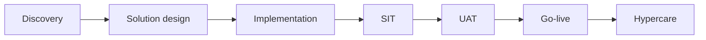

# Salescode — Enterprise Implementation Lifecycle

**Context:** I work as a Senior Technical Project Development Associate at Salescode.ai, owning the technical arc of enterprise SaaS rollouts for Coca-Cola bottler implementations across Thailand, the Philippines, and North India. This document describes **how** those implementations are run — phases, artifacts, debug domains, and failure modes — in sanitized form suitable for portfolio and interview review.

**What this is not:** customer-confidential payloads, internal URLs, real Kafka topic names, LOB identifiers, auth tokens, or copy-paste integration recipes. Customer systems are referred to generically (bottler DMS, field app, ERP-adjacent master data).

**Approved UI reference:** Coke Buddy field-sales screen (Thailand rollout) — screenshot only, no live system access assumed for readers.

---

## Problem

Coca-Cola bottlers operate retail execution and ordering through a mix of field-sales apps, distributor management systems (DMS), and local ERP/master-data sources. Salescode's platform must sit in the middle: one product experience for reps and back-office, many upstream systems per country.

The failure mode is rarely "the REST call returned 500." It is:

1. **Workflow misalignment.** Operations, sales, IT, and the vendor each hold a different mental model of the same order or outlet sync step.
2. **Master-data drift.** Product, outlet, hierarchy, and pricing records disagree between field systems and the platform after cutover.
3. **Integration brittleness at scale.** Event backlogs, partial SQL updates, and non-idempotent consumers surface weeks after go-live.
4. **Testing gaps.** SIT passes on happy paths; UAT breaks on real outlet hierarchies, promo rules, and legacy SKU mappings.
5. **Hypercare without playbooks.** Production issues become heroics instead of repeatable runbooks.

My job is to keep discovery, design, build, test, cutover, and hypercare aligned so field reps and back-office actually trust the data.

---

## Goals and non-goals

### Goals

- Run discovery and solution design workshops with business and IT stakeholders (including onsite work in Thailand)
- Translate bottler-specific workflows into implementable requirements and integration contracts
- Deliver and debug integrations across REST APIs, Kafka event streams, and SQL master-data paths
- Own SIT/UAT coordination, defect triage, and go-live cutover checklists per region
- Stay through hypercare: production RCA, replay procedures, roadmap input
- Leave behind operator playbooks, validation checklists, and requirement traceability — not tribal knowledge

### Non-goals

- Publishing proprietary Salescode platform source or internal admin credentials
- Claiming authorship of the core SaaS product codebase (I implement and integrate against it)
- Exposing customer-specific pricing rules, promo payloads, or production credentials
- Replacing bottler IT as system-of-record owner for ERP/DMS

---

## Implementation lifecycle

### Phase 1 — Discovery

**Purpose:** Establish a single shared picture of how field reps and back-office actually work today.

| Activity | Output |
|----------|--------|
| Stakeholder workshops (ops, sales, IT) | Workflow maps on whiteboard / Confluence |
| Current-state system inventory | Source-of-truth matrix (which system owns outlet, product, price, stock) |
| Pain-point prioritization | Ranked backlog tied to business outcomes (order capture, visit compliance, inventory visibility) |
| Regional constraint capture | Language, hierarchy depth, promo complexity, connectivity assumptions |

**Thailand onsite:** Running workshops in-country surfaced that delays were often alignment issues, not API bugs — different teams used the same field names for different concepts. That shaped every later phase: workflow first, pipes second.

### Phase 2 — Solution design

**Purpose:** Turn agreed workflows into integration architecture and testable requirements.

| Activity | Output |
|----------|--------|
| To-be workflow definition | Swimlanes: rep action → platform → DMS/ERP feedback |
| Integration contract design | REST resource map, event shapes (conceptual), SQL sync boundaries |
| Master-data strategy | Product, outlet, hierarchy, pricing — initial load vs delta sync |
| Non-functional requirements | Idempotency, retry, reconciliation, fail-safe consumer behavior |
| Traceability seed | Requirement ID → design element → test case stub |

**Design principle:** Business rules enforced at the integration boundary, not left to client-side discipline in the field app.

### Phase 3 — Implementation

**Purpose:** Build and configure integrations, mappings, and operator workflows.

| Workstream | Typical deliverables |
|------------|---------------------|
| API integrations | REST gateways between platform and bottler DMS/field endpoints |
| Event integrations | Kafka producers/consumers for order, master-data, and status propagation |
| SQL / batch paths | Master-data loads, stock reset jobs, hierarchy mapping tables |
| Configuration | Pricing workflows, outlet hierarchies, role-based field visibility |
| Operator playbooks | Step-by-step guides for back-office actions that must run the same way every time |

Debug during build is cross-domain: Postman for REST contracts, log tailing for Kafka consumer lag, SQL diffs for master-record mismatches, JSON transform inspection when payload mapping drifts.

### Phase 4 — SIT (System Integration Testing)

**Purpose:** Prove components work together in a controlled environment before business users touch it.

| Activity | Output |
|----------|--------|
| Environment parity check | SIT mirrors prod topology at integration boundaries (sanitized data) |
| Interface test packs | REST + Kafka + SQL scenarios with expected request/response shapes |
| Defect logging | Jira tickets with reproduction, logs, owning workstream |
| Regression gates | No promotion to UAT while P1 integration defects remain open |

SIT catches wiring errors. It does not catch "the rep's real Tuesday route."

### Phase 5 — UAT (User Acceptance Testing)

**Purpose:** Bottler business users validate workflows against real operational scenarios.

| Activity | Output |
|----------|--------|
| UAT scripts by role | Field rep, supervisor, back-office — tied to requirement IDs |
| Validation checklists | Sign-off per workflow (order capture, returns, master-data refresh, etc.) |
| Defect triage | Business severity vs technical severity |
| Training dry-runs | Playbook walkthroughs with super-users |

UAT is where hierarchy edge cases, promo stacking, and legacy SKU aliases usually appear — the scenarios SIT simplified away.

### Phase 6 — Go-live

**Purpose:** Controlled cutover with rollback awareness.

| Activity | Output |
|----------|--------|
| Cutover runbook | Ordered steps, owners, timestamps, rollback triggers |
| Data migration / delta freeze | Final sync window documented |
| Smoke tests in prod | Minimal path: login → capture order → downstream visibility |
| War-room comms | Single POC channel for first 24–72 hours |

I have served as primary technical POC for go-lives across three countries. Each region differed in cutover window, data volume, and upstream system maturity — the runbook template stayed; the sequencing did not.

### Phase 7 — Hypercare

**Purpose:** Stabilize production and convert incidents into systemic fixes.

| Activity | Output |
|----------|--------|
| Production monitoring | CloudWatch/log dashboards, consumer lag alerts, API error budgets |
| RCA and hotfix | Same-day patches where safe; event replay when appropriate |
| Reconciliation jobs | Catch-up sync when upstream drift detected |
| Handoff to steady-state | Updated runbooks, known-issues list, roadmap items |

**Example incident pattern (sanitized):** Field rep cannot sync an order → API timeout symptom → Kafka consumer lag → stale SQL master record → dropped delta update. Fix: patch + replay + design idempotency so the failure mode cannot silently recur. The bug was often a design decision from months earlier, not a one-line code mistake.

---

## Artifacts (conceptual)

These are the document types that make rollouts repeatable — not copies of internal files.

| Artifact | Purpose |
|----------|---------|
| **Discovery playbook** | Workshop agenda, question bank, workflow capture template |
| **Integration runbook** | Step sequence for initial load, delta sync, and failure recovery |
| **Workflow maps** | As-is / to-be swimlanes shared with business and IT |
| **Validation checklists** | Per-role UAT sign-off with pass/fail and evidence column |
| **Requirement traceability matrix** | Req ID → design → SIT case → UAT case → go-live smoke |
| **Cutover checklist** | Ordered tasks, owners, rollback criteria |
| **Hypercare runbook** | Top incidents, log locations (generic), escalation path |
| **Operator playbook** | How back-office runs pricing/stock/hierarchy changes without breaking sync |

AI-assisted delivery (docs drafts, payload validation helpers, SQL draft review, RCA summaries) accelerates artifact production; human review and customer sign-off remain mandatory.

---

## Debug domains (generalized)

| Domain | What breaks | How I debug (pattern) |
|--------|-------------|----------------------|
| **REST** | 4xx/5xx, timeout, schema mismatch | Postman reproduction → compare contract doc vs actual payload → check auth/header/LOB context (generic) → fix mapping or upstream |
| **Kafka** | Consumer lag, poison messages, duplicate processing | Inspect lag metrics → read consumer logs → identify non-idempotent handler → replay from safe offset after fix |
| **SQL** | Master record stale, hierarchy orphan, pricing row missing | Row-level diff against source snapshot → trace last successful sync job → fix transform or schedule catch-up |
| **JSON transforms** | Field rename, null handling, array vs object | Golden-file comparison on sanitized samples → update mapping layer → regression in SIT |
| **CloudWatch / logs** | Latency spikes, throttling | Time-boxed log query around incident → correlate API → bus → DB timestamps → identify bottleneck layer |

No internal topic names, connection strings, or customer LOB headers appear here by design.

---

## Regional scope (resume-level)

| Region | Role summary |
|--------|--------------|
| **Thailand** | Onsite discovery workshops; wholesaler-to-retailer ordering platform alignment; field-sales UI (Coke Buddy) in rollout |
| **Philippines** | Integration and UAT/go-live support for bottler DMS ↔ platform sync |
| **North India** | Master-data, pricing, and hierarchy mapping; production support |

"Live across three countries" means production rollouts reached go-live with field and back-office on the platform — not that every module is identical across regions.

---

## Outcomes

| Claim | Status |
|-------|--------|
| End-to-end ownership from discovery workshops through hypercare | Defensible — primary technical POC on rollouts |
| Three-country go-live participation (TH, PH, North India) | Defensible — resume-level |
| Integration work across REST, Kafka, SQL | Defensible — pattern-level |
| ~40% reliability improvement via SQL/Kafka/API RCA | **[VALIDATE]** — cite only with internal approval and measurement definition |
| ~60% reduction in manual intervention on integrated workflows | **[VALIDATE]** — cite only with before/after scope defined |
| Onsite discovery in Thailand | Defensible |

Do not publish customer-internal metrics without Salescode/Coca-Cola approval.

---

## Screenshot

### Coke Buddy — field sales (Thailand, approved UI)

*Approved portfolio screenshot only. Represents the field-rep surface in a bottler retail-execution rollout — not a live login or production data feed for readers.*

---

## Claim checklist

Use before publishing externally. Tick when verified.

### Scope and sanitization

- [ ] No proprietary payloads, Kafka topic names, or internal URLs
- [ ] No auth tokens, LOB headers, or customer system hostnames
- [ ] Customer names limited to resume-level (Coca-Cola bottlers, Thailand / Philippines / North India)
- [ ] Coke Buddy screenshot is approved-for-portfolio only
- [ ] No claim of authorship over core Salescode product codebase

### Role and ownership

- [ ] "Primary technical POC" phrasing matches actual engagement letters / manager confirmation [VALIDATE]
- [ ] Onsite Thailand workshops accurately described
- [ ] Three-country go-live claim matches employment record
- [ ] Playbook/runbook work described as artifacts, not attached confidential files

### Metrics

- [ ] ~40% reliability improvement marked [VALIDATE] or removed
- [ ] ~60% manual effort reduction marked [VALIDATE] or removed
- [ ] No fabricated defect counts or uptime percentages

### Technical claims

- [ ] REST / Kafka / SQL debug patterns are generalized (no customer-specific repro steps)
- [ ] Incident example is sanitized and does not identify customer individuals
- [ ] AI-assisted delivery described as acceleration, not unsupervised automation

### Anti-clone redaction

- [ ] No Postman collection exports or curl one-liners with real credentials
- [ ] No copy-paste SQL from production schemas
- [ ] No internal Confluence/Jira links
- [ ] No step-by-step recipe to replicate proprietary integration mappings
