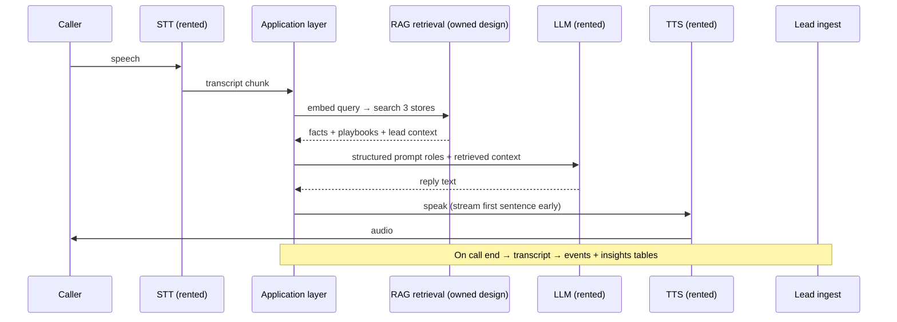
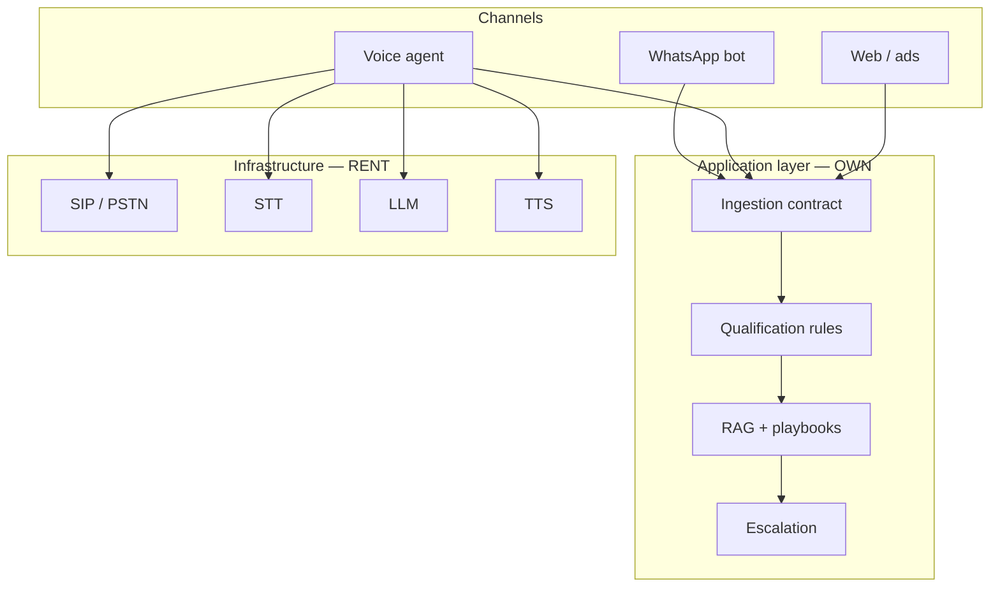

# Deploying an Enterprise AI Voice Agent

**Thesis:** Most teams conflate "voice AI" with picking a vendor stack. That confusion hides where value actually lives. **Telephony, STT, LLM, and TTS are rented infrastructure.** Discovery, conversation design, qualification logic, business rules, RAG architecture, tool contracts, escalation, testing, and rollout are **application work** — and that is what determines whether a voice agent converts or burns leads.

This essay separates the two layers, uses ReliveCure's voice design as a evaluated-but-not-shipped example, and references Salescode enterprise voice-agent support as application-layer delivery work in a multi-tenant SaaS context.

**What this is not:** a LiveKit/SIP rebuild recipe, full prompt text, vector index schemas, or vendor API clone-and-run instructions.

---

## Why the split matters

A voice agent is four physical layers:

| Layer | Typical components | Own or rent? |
|-------|-------------------|--------------|
| Telephony | PSTN, SIP trunk, DIDs, DLT compliance (India) | **Rent** — regulation and carrier physics |
| Ears (STT) | Streaming speech-to-text | **Rent or self-host** — commodity; not moat |
| Brain (LLM + app logic) | Inference + retrieval + business rules | **Rent inference; own application design** |
| Voice (TTS) | Text-to-speech, Hindi/Hinglish quality | **Rent or self-host** — quality-sensitive, not proprietary |

Teams that outsource all four to a bundled "voice API" ship faster and pay a markup. Teams that self-host orchestration but rent carriers can keep marginal cost near **SIP minutes + voice quality tier** — but only if they invest in the application layer.

**Interview-grade insight:** In enterprise and vertical-SaaS deployments, the hard meetings are not "which STT API." They are: Who owns qualification fields? What happens on partial capture? When does the agent escalate? How does a call write back to the same lead record as WhatsApp? Those are application decisions.

---

## Part A — Infrastructure (assemble, do not claim authorship)

### Telephony / SIP

- Bridges the agent to the public phone network via wholesale SIP trunk and inbound/outbound DIDs.
- In India, outbound at scale requires **DLT registration, DND scrubbing, and consent scripts** (TRAI) — non-negotiable before volume.
- Orchestration frameworks (e.g. LiveKit Agents, Pipecat-class tools) handle SIP bridge, streaming, barge-in, and turn-taking — **glue, not product IP**.

**Do not claim:** authorship of PSTN, carrier relationships, or SIP stack implementation.

### Speech-to-text (STT)

- Streaming STT (commercial APIs or self-hosted Whisper-class models) converts audio to text with latency budget pressure.
- Hindi/Hinglish code-mixing and noisy mobile lines affect accuracy; domain tuning is limited compared to application-side disambiguation ("Did you mean minus 4 or plus 4 diopters?").

**Do not claim:** STT model training or fundamental ASR research.

### LLM inference

- Low-latency first-token providers suit voice turn-taking; separate inference pools from other channels (e.g. WhatsApp bots on a maxed shared quota).
- The LLM is **rented muscle** — it knows nothing about your clinic, bottler, or insurance matrix without application context.

**Do not claim:** foundation model authorship.

### Text-to-speech (TTS)

- Hindi voice quality is conversion-critical: robotic TTS loses leads on phone.
- Engine tradeoffs: latency, cost per minute, naturalness in Hinglish — evaluated by A/B on real scripts, not spec sheets.
- Cost swing factor: premium multilingual voices vs budget Indian engines can differ by an order of magnitude per minute **[VALIDATE — rates change; verify live vendor pricing before budgeting]**.

**Do not claim:** voice cloning IP unless you actually built the vocoder.

### Orchestration runtime

- Self-hosted agent runtime connects STT → application logic → LLM → TTS, manages VAD endpointing, barge-in, and concurrent sessions.
- Latency target for conversational feel: roughly **600–800 ms** per turn — achieved by streaming all layers, short replies, backchannel fillers while retrieval runs, and starting TTS on first sentence chunk.

**Do not claim:** authorship of open-source orchestration frameworks.

### Infrastructure cost shape (approximate)

Marginal cost trends toward **carrier minutes + chosen voice tier** when brain and ears are self-hosted or on free tiers. Illustrative pilot math from internal planning (not audited):

| Cost driver | Order of magnitude | Notes |
|-------------|-------------------|-------|
| SIP minutes | ~₹0.4–0.5/min | **[VALIDATE]** wholesale rate |
| STT (hosted) | ~₹0.3–0.4/min | **[VALIDATE]** or ~₹0 if self-hosted |
| LLM | pennies at pilot volume | separate pool from other apps |
| TTS | ~₹1–8/min depending on engine | largest swing factor |
| Self-host crossover | ~2–4 hrs calls/day sustained | below that, hosted APIs often cheaper |

Do not treat these as quotes. Verify live rates before financial decisions.

---

## Part B — Application layer (where implementations win or lose)

This is the work an FDE / solutions engineer / product engineer **should** own and defend in interview.

### 1. Discovery

Before stack selection:

- Map **inbound vs outbound** use cases (support vs conversion — different success metrics).
- Identify **system of record** for leads (CRM, pre-CRM queue, ticketing).
- Define **qualification fields** that must be captured on call (age, prescription, insurance, intent band — vertical-specific).
- Capture **escalation triggers** (hot lead, angry caller, medical edge case, explicit human request).
- Align **compliance** (consent, recording disclosure, DLT scripts for India outbound).

At Salescode, enterprise voice-agent work sits in this discovery + workflow alignment space for SaaS tenants — integrating voice outcomes with existing lead and field workflows, not building STT from scratch.

### 2. Conversation design

- **Role structure in prompts** (not prompt text here): system policy, persona guardrails, tool-use instructions, escalation policy, language register (Hindi/Hinglish).
- **Turn design:** short questions, confirm critical fields, objection branches — mined from real rep calls where possible.
- **Conversion-first vs support-first:** ReliveCure voice design targets consult booking and qualification, not FAQ deflection.

### 3. Qualification logic and business rules

- Field extraction must merge into the **same ingestion contract** as other channels (WhatsApp, web forms) — append-only, no silent overwrites.
- Thresholds for "qualified enough to push CRM" are business rules, not LLM whims.
- Objection handling routes through **playbook retrieval**, not ad-lib generation, for regulated or high-stakes claims (insurance coverage, pricing).

### 4. RAG design (conceptual — three stores)

ReliveCure's designed architecture (evaluated, **not shipped** as live voice):

| Store | Contents | Purpose |
|-------|----------|---------|
| **Knowledge vectors** | Facts: insurance matrices, pricing bands, eligibility, FAQs | Accuracy — answers must match current policy |
| **Playbook vectors** | Objection → response pairs from **winning human call transcripts** | Persuasion — lines that actually closed |
| **Lead memory** | This caller's CRM + WhatsApp history, intent signals | Continuity — no "who are you again?" |

Per-turn flow (application-owned):

**Moat claim (defensible):** vector content, refresh cadence, and retrieval merge logic — not Groq/Deepgram/ElevenLabs.

**Freshness (designed):** a scheduled knowledge-scout job re-crawls policy/competitor sources, re-embeds, flags diffs — same cron-runtime pattern as other ReliveCure agents. Not production for voice until voice ships.

### 5. Tools and escalation

Application layer defines **tool contracts**:

- Book consult / create callback task
- Lookup lead by phone
- Escalate to human queue with context packet
- Log structured qualification fields to ingest pipeline

Escalation must pass **retrieved context + transcript summary** to the human — not raw audio only.

### 6. Testing and UAT

| Layer | Test type |
|-------|-----------|
| Infrastructure | Latency probes, barge-in, drop/recover |
| Application | Script-based roleplay suites per objection path |
| Integration | Call end → CRM row → same fields as WhatsApp path |
| Compliance | Consent script read, DND behavior, recording disclosure |
| Voice quality | A/B Hindi naturalness on fixed scripts — human rubric, not BLEU |

Salescode UAT patterns for enterprise features apply here: requirement-linked checklists, business sign-off, defect severity tied to workflow blocking — adapted for conversational outcomes ("qualified field captured," "escalation triggered," "CRM writeback verified").

### 7. Rollout phasing

**ReliveCure — designed phasing (not shipped):**

| Phase | Scope | Status |
|-------|-------|--------|
| P0 pilot | Outbound only, low concurrency, RAG from existing KB, one qualified call logged to CRM | Designed |
| P1 | Daily RAG refresh + inbound DID | Designed |
| P2 | Concurrency scaling + India DLT/DND compliance hardening | Designed |
| P3 | Call-intelligence reporting — AI vs rep coaching | Designed |

**What actually ships today on ReliveCure calls:** Rep Android app uploads recordings; local transcribe job writes to call recordings + lead timeline events. Lore reads these. **Zero production AI voice agent calls.**

**Salescode — application-layer work (shipped in enterprise context):** Supporting voice-agent features as part of SaaS delivery — tenant workflow alignment, integration with lead/field data models, UAT for voice-triggered outcomes. Infrastructure vendors and core telephony stack are platform-owned; my contribution is implementation lifecycle and application boundary design, not STT/TTS engine authorship.

---

## Designed vs shipped — summary table

| Item | ReliveCure | Salescode enterprise voice |
|------|------------|---------------------------|
| Conversation design + qualification rules | **Designed** | **Shipped** (tenant workflows) |
| RAG three-store architecture | **Designed** | Platform-dependent |
| CRM writeback to shared lead tables | **Designed** (same ingest as WhatsApp) | **Shipped** (integration patterns) |
| LiveKit/SIP/STT/TTS stack | **Evaluated**, not prod | Rent/platform stack |
| Production AI voice calls | **0** | Tenant-specific [VALIDATE scope] |
| Call recording + transcribe for reps | **Partial** (upload pipeline) | N/A in this doc |

---

## Risks (call them in discovery, not after go-live)

1. **Compliance (India outbound):** DLT/DND/consent — blocks numbers if ignored.
2. **Latency:** Self-hosted streaming pipeline under 800 ms is engineering-heavy; fillers and streaming TTS mask retrieval delay.
3. **Voice quality:** Budget TTS fails conversion before the LLM gets blamed.
4. **Channel parity:** Voice captures fields WhatsApp also captures — ingestion conflicts if contracts differ.
5. **GPU economics:** Self-host STT/TTS only wins at sustained daily volume; pilot usually hosted.

---

## Architectural placement in a multi-channel CRM

Voice is one more channel into the same application spine — not a separate product silo.

---

## What I would defend in an interview

- **Split infrastructure vs application** clearly; no false claims on engine authorship.
- **Designed** ReliveCure voice: three-store RAG, shared ingest with WhatsApp, Hindi/Hinglish conversion-first scripts, phasing through compliance.
- **Shipped** ReliveCure partial: rep call upload → transcribe → timeline events (not AI voice loop).
- **Enterprise delivery** at Salescode: voice-agent support as workflow + integration + UAT within SaaS rollouts.
- **Anti-pattern:** buying a voice API and skipping conversation design, qualification contracts, and CRM writeback — fast demo, no production trust.

---

## Claim checklist

Use before publishing externally. Tick when verified.

### Layer separation

- [ ] Infrastructure (SIP, STT, LLM, TTS) described as rent/assemble — not authored
- [ ] Application layer items listed as ownable work
- [ ] No LiveKit/SIP setup recipe or config dumps

### ReliveCure status

- [ ] Voice agent marked **designed, not shipped**
- [ ] Zero production AI voice calls stated accurately
- [ ] Rep upload/transcribe pipeline marked Partial/shipped separately
- [ ] RAG described as three-store concept — no index schemas or embedder configs

### Salescode status

- [ ] Enterprise voice work described as application-layer delivery — not platform engine authorship
- [ ] No customer confidential payloads or internal URLs
- [ ] Tenant shipped scope marked [VALIDATE] where not personally verified

### Costs and vendors

- [ ] All ₹/min figures marked approximate or [VALIDATE]
- [ ] No presentation of cost tables as audited quotes
- [ ] Vendor names used as examples, not endorsements

### Anti-clone redaction

- [ ] No full system prompts or conversation scripts
- [ ] No API keys, SIP credentials, or DLT registration details
- [ ] No step-by-step rebuild for orchestration stack
- [ ] No exact latency SLA presented as contractual guarantee
